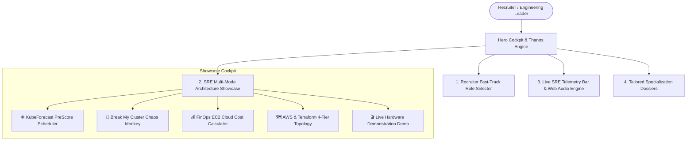

# ⚡ Shyam Kumar D — SRE & Cloud DevOps Engineering Portfolio

<div align="center">

  <h3>Production-Grade Cloud Systems • Deterministic Kubernetes Schedulers • Automated Terraform IaC</h3>

  <p>
    <strong>B.Sc. Networking (Cloud Computing) — 6th Semester Undergraduate</strong><br />
    🎯 <em>Actively seeking a <strong>6-Month Full-Time Internship (PPO Track)</strong> & graduate <strong>Cloud / DevOps / SRE Roles</strong></em>
  </p>

  <div>
    <a href="https://github.com/ShyamD2/Personal-Portfolio/blob/main/LICENSE.txt"></a>
    <a href="https://react.dev/"></a>
    <a href="https://www.typescriptlang.org/"></a>
    <a href="https://vitejs.dev/"></a>
    <a href="https://aws.amazon.com/"></a>
    <a href="https://kubernetes.io/"></a>
    <a href="https://www.terraform.io/"></a>
  </div>

  <br />

  <p>
    <a href="mailto:shyamcloud021@gmail.com"><strong>📬 Direct Email</strong></a> •
    <a href="https://www.linkedin.com/in/shyam-kumar-d-951254329/"><strong>💼 LinkedIn Profile</strong></a> •
    <a href="https://github.com/ShyamD2"><strong>💻 GitHub Profile</strong></a>
  </p>

</div>

---

## 📌 Executive Overview

This repository houses the source code for the high-performance engineering portfolio of **Shyam Kumar D**. Built with **React 18**, **TypeScript**, and **Vite**, the application functions as an interactive **SRE Cockpit**, providing recruiters, infrastructure architects, and engineering managers with hands-on simulations of real-world distributed cloud workloads, cost optimization algorithms, and automated incident containment.

### 🎯 Current Candidate Availability:
- **6th Semester 6-Month Full-Time Internship** (Jan–June / Immediate start, dedicated college term with PPO track)
- **Graduate Cloud Infrastructure / DevOps / SRE Positions** (2026/2027 Cohort)
- **Work Model**: Open to On-Site Relocation (Bangalore, Chennai, Hyderabad, Pune, etc.) and Remote

---

## 📐 System Architecture & Cockpit Modules



---

## 🚀 Key Interactive Engineering Modules

### 1. 🎯 Recruiter "Fast-Track" Role Selector
Allows hiring managers to filter candidate qualifications based on the exact job requirements:
- **Kubernetes & SRE**: Custom Go scheduler evaluation hooks, 90.35ns latency budget, dynamic 75% waterline bin-packing.
- **Cloud Infrastructure (AWS)**: Multi-region VPC peering fabric, dual Transit Gateway redundancy, and HA multi-AZ subnets.
- **DevOps & CI/CD (IaC)**: 100% codified Terraform codebases with remote S3 backends, DynamoDB state locking, and Trivy CVE scanning.
- **DevSecOps & SOAR**: Project AEGIS autonomous incident containment with AWS EventBridge, GuardDuty, and WAFv2.
- *Includes tailored **Executive Summary Dossiers** with technical proof points and direct PDF CV downloads.*

### 2. 🐒 "Break My Cluster" Chaos Engineering Simulator
Interactive incident injection simulator testing system resilience against real-world distributed infrastructure anomalies:
- **💥 Spot Instance Interruption**: Simulates sudden AWS EC2 Spot 2-minute eviction notices; KubeForecast drains and consolidates surviving pods in under 1.2s.
- **⚡ 400% Traffic Surge**: Dynamic waterline scaling calculation prevents SLA violations without overprovisioning.
- **🛡️ Malicious SSH Brute-Force Scan**: Project AEGIS SOAR captures GuardDuty telemetry and autonomously blacklists rogue IPs via AWS WAF API in **820ms**.

### 3. 💰 FinOps Cloud Cost-Reduction Calculator
Interactive financial engineering model showcasing tangible compute savings:
- Real-time sliders for worker node count (6 to 250 EC2 instances) and CPU fragmentation (15% to 55%).
- Multiple instance families: `c5.xlarge`, `m5.large`, `c6i.2xlarge`, `r5.2xlarge`.
- Computes unoptimized monthly spend vs. KubeForecast 75% waterline spend, projecting annualized ROI (e.g., **-$84,600/year** compute savings).

### 4. 🗺️ AWS & Terraform Network Topology Explorer
Multi-tier codified visualizer for mission-critical cloud infrastructure:
1. **Edge & Ingress**: AWS WAFv2, CloudFront CDN, and Application Load Balancer rate-limiting.
2. **Central Backbone**: AWS Transit Gateway hub with isolated route tables and BGP failover.
3. **Compute Tier**: Amazon EKS v1.30 managed node groups running KubeForecast Go scheduling hooks.
4. **Data Layer**: Amazon Aurora Multi-AZ database cluster with AWS KMS envelope encryption.
- *Inspect live CIDR subnet blocks and copy production-ready Terraform HCL code directly to your clipboard.*

### 5. 🎬 Thanos Disintegration Particle Engine & Audio FX
- Authentic Infinity War particle disintegration engine built with native HTML5 Canvas pixel manipulation.
- Single-play unmuted video with realistic room preservation and red theme shift.
- **Mission Control Web Audio Engine**: Procedural synthesizers producing tactile clicks, success chimes, and chaos sirens with zero external MP3 dependencies.

### 6. 📡 Global SRE Telemetry Bar
- Persistent bottom ticker tracking simulated AWS us-east-1 latency, KubeForecast 90.35ns benchmark, and open-for-hire status.
- Master **SFX ON / SFX MUTED** toggle with local storage memory.

---

## 📊 Quantifiable Engineering Benchmarks

| Metric | Measured Benchmark | Engineering Implementation |
| :--- | :--- | :--- |
| **KubeForecast PreScore Latency** | **90.35 ns** | Go compiled scheduler hook evaluating node candidates |
| **Compute Waste Reduction** | **Up to 50%** | Deterministic 75% waterline bin-packing algorithm |
| **SOAR Incident Isolation** | **820 ms** | AWS GuardDuty &rarr; EventBridge &rarr; Lambda &rarr; AWS WAFv2 |
| **IaC Codification Ratio** | **100%** | Zero manual console clicks; Terraform modular architecture |
| **Bundle Efficiency** | **Zero Bloat** | Native Web Audio API synthesis; zero heavy audio libraries |

---

## 📂 Codebase Structure

```bash
Personal-Portfolio/
├── public/
│   ├── audio/                    # Authentic Thanos snap sound effect MP3
│   ├── certificates/             # AWS Academy, Linux, & Cybersecurity accreditations
│   ├── reports/                  # Complete empirical project research PDF reports
│   └── videos/                   # High-definition KubeForecast live demo recordings
├── src/
│   ├── components/
│   │   ├── Interactive/
│   │   │   ├── ArchitectureShowcase.tsx    # SRE Multi-Mode Cockpit controller
│   │   │   ├── ChaosSimulator.tsx          # Chaos Monkey incident simulator
│   │   │   ├── FinOpsCalculator.tsx        # Interactive EC2 cost calculator
│   │   │   ├── HireMeModal.tsx             # Contact channels & internship availability
│   │   │   ├── NetworkTopologyExplorer.tsx # 4-Tier AWS & Terraform visualizer
│   │   │   ├── RecruiterRoleSelector.tsx   # Fast-Track role filters & dossiers
│   │   │   └── SRETelemetryBar.tsx         # Fixed bottom telemetry bar & audio toggle
│   │   ├── Layout/
│   │   │   ├── Navbar.tsx                  # Responsive navigation header
│   │   │   └── Footer.tsx                  # Bottom footer with back-to-top action
│   │   ├── AboutSection.tsx                # Candidate biography & 6th sem internship summary
│   │   ├── CertificationsSection.tsx       # Verified industry credentials
│   │   ├── ContactSection.tsx              # Direct outreach with shyamcloud021@gmail.com
│   │   ├── HeroSection.tsx                 # Video background & Thanos particle canvas
│   │   ├── InternshipSection.tsx           # Industry experience timeline
│   │   ├── ProjectReportsSection.tsx       # Downloadable engineering blueprints
│   │   ├── ProjectsSection.tsx             # Production cloud architectures showcase
│   │   ├── SkillsSection.tsx               # Tech stack matrix (AWS, K8s, Terraform, Linux)
│   │   └── TimelineSection.tsx             # Academic & engineering evolution
│   ├── utils/
│   │   └── soundEffects.ts                 # Web Audio API procedural sound synthesizers
│   ├── App.tsx                             # Application root with IntersectionObserver
│   ├── index.css                           # Modern CSS variables, glassmorphism & resets
│   └── main.tsx                            # React 18 DOM mount point
├── .gitignore                              # Git exclusion rules (node_modules, dist, logs)
├── index.html                              # HTML entry point with meta tags & typography
├── LICENSE.txt                             # MIT License
├── package.json                            # Scripts & dependency definitions
├── tsconfig.json                           # TypeScript strict compiler configuration
└── vite.config.js                          # Vite build & asset bundling configuration
```

---

## 🛠️ Tech Stack & Tooling

- **Core Framework**: [React 18](https://react.dev/) with [TypeScript 5](https://www.typescriptlang.org/)
- **Bundler & Tooling**: [Vite 5](https://vitejs.dev/)
- **Icons & Visuals**: [Lucide React](https://lucide.dev/), HTML5 Canvas 2D Particle Engine
- **Audio Synthesis**: Native Web Audio API (Sine, Sawtooth, and Triangle procedural oscillators)
- **Infrastructure Tested**: Amazon Web Services (EKS, VPC, Transit Gateway, WAFv2, GuardDuty, Lambda, EventBridge, RDS Aurora)
- **Infrastructure as Code**: Terraform v1.5+ (S3 Backend, DynamoDB State Locking)
- **Container Orchestration**: Kubernetes v1.30+ / Custom Go kube-scheduler plugins

---

## ⚡ Getting Started & Local Development

### Prerequisites
- **Node.js**: v18.0.0 or higher
- **Package Manager**: npm (v9+) or yarn

### 1. Clone the Repository
```bash
git clone https://github.com/ShyamD2/Personal-Portfolio.git
cd Personal-Portfolio
```

### 2. Install Dependencies
```bash
npm install
```

### 3. Start Development Server
```bash
npm run dev
```
Open your browser and navigate to `http://localhost:5173/`.

### 4. Build for Production
```bash
npm run build
```
Executes TypeScript compilation (`tsc`) and generates optimized production assets in the `dist/` directory.

### 5. Preview Production Build Locally
```bash
npm run preview
```

---

## 📬 Contact & Recruiter Connect

<div align="center">

| Channel | Link / Handle | Status |
| :--- | :--- | :--- |
| **Email** | [shyamcloud021@gmail.com](mailto:shyamcloud021@gmail.com) | Primary Communication |
| **LinkedIn** | [linkedin.com/in/shyam-kumar-d-951254329](https://www.linkedin.com/in/shyam-kumar-d-951254329/) | Professional Network |
| **GitHub** | [@ShyamD2](https://github.com/ShyamD2) | Codebases & Open Source |
| **Location** | Madurai, Tamil Nadu, India | Open to Relocation & Remote |

</div>

---

<div align="center">
  <sub>Designed & engineered by <strong>Shyam Kumar D</strong> with a relentless focus on high availability, low latency, and deterministic systems.</sub>
</div>
